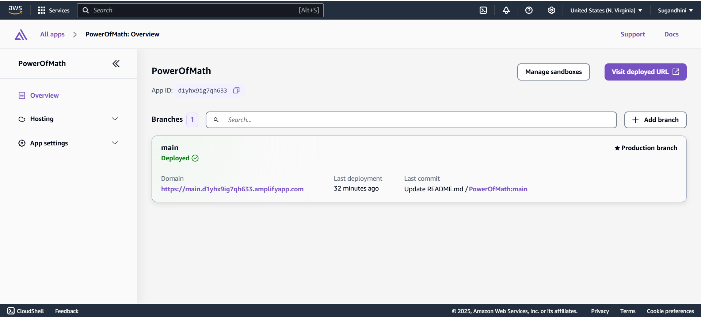
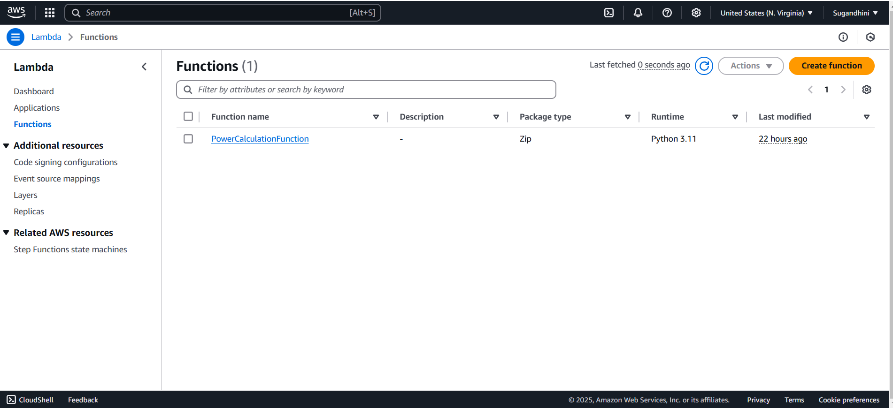
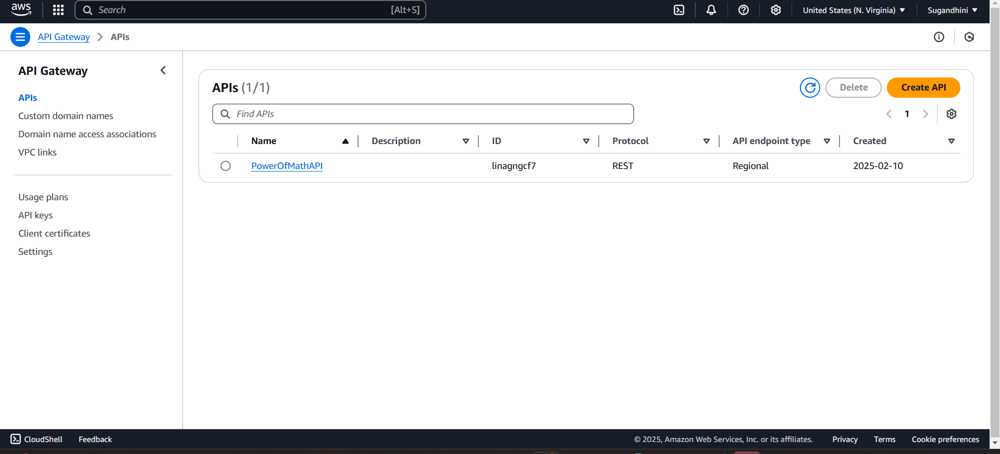
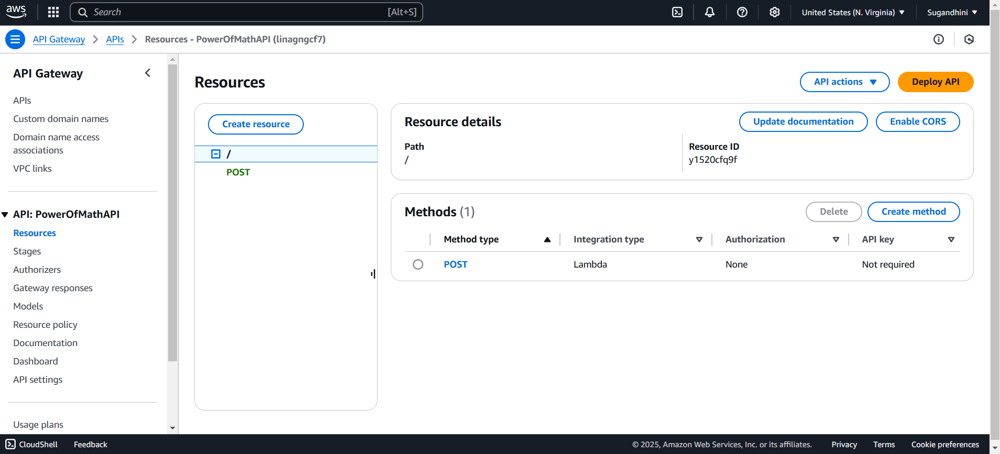
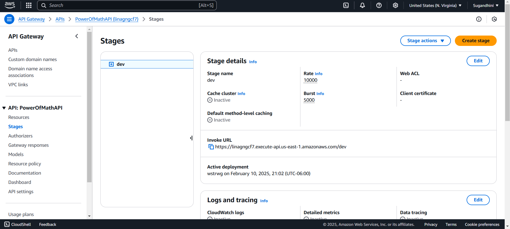
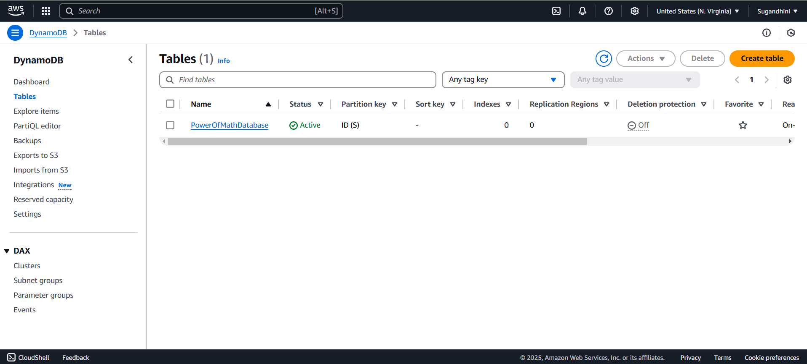

# 📌 Power Of Math Project

This project is a simple **Power Calculation App** that allows users to input a base number and an exponent to compute the power using **AWS Lambda, API Gateway, and DynamoDB**. The result is stored in **DynamoDB** and displayed on a front-end web page.

---

## 🚀 Project Overview
- **Frontend**: HTML, CSS, JavaScript  
- **Backend**: AWS Lambda (Python)  
- **Database**: DynamoDB  
- **API**: AWS API Gateway  
- **Hosting**: AWS Amplify  

---

## 🔹 How It Works
1. User enters a base and exponent in the web app.  
2. A **POST request** is sent to the API Gateway.  
3. API Gateway triggers the **AWS Lambda function**.  
4. Lambda performs the **power calculation**.  
5. The result is stored in **DynamoDB**.  
6. The result is displayed in the **browser**.  

---

## 🛠️ Setting Up AWS Services

### ✅ 1. Deploy on AWS Amplify (Hosting the Web App)
1. Go to the **[AWS Amplify Console](https://console.aws.amazon.com/amplify)**.  
2. Click **"Host a Web App"** → Choose **GitHub** as the source.  
3. Select your repository (`PowerOfMath`) and branch (`main`).  
4. Configure build settings (if needed) → Click **Deploy**.  
5. Once deployment is successful, you’ll get a **live URL**!
6. 

---

### ✅ 2. Create an AWS Lambda Function
1. Open the **[AWS Lambda Console](https://console.aws.amazon.com/lambda)**.  
2. Click **"Create Function"**.  
3. Choose **"Author from scratch"**.  
4. Set function name: `PowerCalculationFunction`.  
5. Select **Runtime**: Python 3.x.  
6. **Execution Role**: Create a new role with basic Lambda permissions.  
7. Click **Create Function**.
8. Replace the function code with:
9. 
    
11. ### **🔹 Lambda Code Before Adding DynamoDB**
```python
import json
import math

def lambda_handler(event, context):
    base = int(event["base"])
    exponent = int(event["exponent"])
    result = math.pow(base, exponent)
    return {
        'statusCode': 200,
        'body': json.dumps(f'Your result is {result}')
    }
```

---

### ✅ 3. Create an API Gateway
1. Go to the **[AWS API Gateway Console](https://console.aws.amazon.com/apigateway)**.  
2. Click **"Create API"** → Choose **REST API** (for full control).  
3. Select **"New API"** → Set **API Name** as `PowerOfMathAPI`.  
4. Choose **Regional** as the **Endpoint Type** → Click **Create API**.
   
**Verify API Gateway CORS Settings**  
If you see a **CORS error** in the browser console:  
- **Go to API Gateway** → Select **Your API**.  
- Click on **"CORS"** and enable it for **ALL methods (POST)**.  
- **Deploy API** again and test.
 
  

**Create a Resource and Method**  
6. In the left menu, click **Actions → Create Resource**.  
7. **Resource Name**: `calculate`  
8. **Resource Path**: `/calculate`  
9. Click **Create Resource**.  
10. Click **Actions → Create Method** → Select **POST** → Click the checkmark ✅.  



**Connect API Gateway to Lambda**  
11. **Integration Type**: Select **Lambda Function**.  
12. **Lambda Function Name**: Enter `PowerCalculationFunction`.  
13. Click **Save**, then **OK** when prompted to add permissions.  

**Deploy the API**  
14. Click **Actions → Deploy API**.  
15. **Deployment Stage**: Click **[New Stage]** → **Stage Name**: `dev` → Click **Deploy**.  
16. **Copy the Invoke URL** (e.g., `https://xyz123.execute-api.us-east-1.amazonaws.com/prod/calculate`). 



---

### ✅ 4. Create a DynamoDB Table
1. Go to the **[AWS DynamoDB Console](https://console.aws.amazon.com/dynamodb)**.  
2. Click **"Create Table"**.  
3. **Table Name**: `PowerOfMathDatabase`.  
4. **Primary Key**: `calculationId` (String).  
5. Click **Create Table**.
   


---

## ✅ Connecting Lambda to DynamoDB  
### Step 1: Attach IAM Permissions to Lambda
1. Go to the **[AWS IAM Console](https://console.aws.amazon.com/iam)**.  
2. Click **Roles** → Find the role attached to your Lambda function.  
3. Click **Attach Policies** → Search for **"AmazonDynamoDBFullAccess"**.  
4. Click **Attach Policy** to grant DynamoDB permissions to Lambda.
5. ✅ Additionally, an inline policy named **PowerOfMathDynamo** is attached to restrict access specifically to PowerOfMathDatabase.

```
{
"Version": "2012-10-17",
"Statement": [
    {
        "Sid": "VisualEditor0",
        "Effect": "Allow",
        "Action": [
            "dynamodb:PutItem",
            "dynamodb:DeleteItem",
            "dynamodb:GetItem",
            "dynamodb:Scan",
            "dynamodb:Query",
            "dynamodb:UpdateItem"
        ],
        "Resource": "YOUR-TABLE-ARN"
    }
    ]
}
```

### ✅ Updating AWS Lambda After Adding Permissions & DynamoDB Integration  
After attaching **IAM policies** to allow Lambda access to DynamoDB, update your function:  
1️⃣ Modify your Lambda function to **store calculations in DynamoDB**.  

```
# import the JSON utility package
import json
# import the Python math library
import math

# import the AWS SDK (for Python the package name is boto3)
import boto3
# import two packages to help us with dates and date formatting
from time import gmtime, strftime

# create a DynamoDB object using the AWS SDK
dynamodb = boto3.resource('dynamodb')
# use the DynamoDB object to select our table
table = dynamodb.Table('PowerOfMathDatabase')
# store the current time in a human readable format in a variable
now = strftime("%a, %d %b %Y %H:%M:%S +0000", gmtime())

# define the handler function that the Lambda service will use an entry point
def lambda_handler(event, context):

# extract the two numbers from the Lambda service's event object
    mathResult = math.pow(int(event['base']), int(event['exponent']))

# write result and time to the DynamoDB table using the object we instantiated and save response in a variable
    response = table.put_item(
        Item={
            'ID': str(mathResult),
            'LatestGreetingTime':now
            })

# return a properly formatted JSON object
    return {
    'statusCode': 200,
    'body': json.dumps('Your result is ' + str(mathResult))
    }
```

2️⃣ Update the function to:
   - Connect to **DynamoDB** using `boto3`.  
   - Store calculation results in **PowerOfMathDatabase**.  
   - Add a timestamp for each entry.  
3️⃣ Test your Lambda function with the **Test feature**.  
4️⃣ Deploy and validate the integration by running test cases.  
5️⃣ Check **DynamoDB** to ensure new data entries appear in the table.

---

## 📌 Final Deployment Checklist
- **Frontend deployed via AWS Amplify**.  
- **Lambda function integrated with API Gateway**.  
- **API URL updated in `index.html`**.  
- **DynamoDB storing calculation results**.  

---

## ❌ Deleting AWS Resources (To Avoid Charges)
If you no longer need the project and want to **avoid AWS charges**, delete the following resources:  

- **DynamoDB Table:** `PowerOfMathDatabase`  
- **Lambda Function:** `PowerCalculationFunction`  
- **API Gateway:** `PowerOfMathAPI`  
- **Amplify App:** Hosted frontend  

---

## 📜 License
This project is open-source under the **MIT License**.  

---

## ✅ Project Completed Successfully! 🚀  
